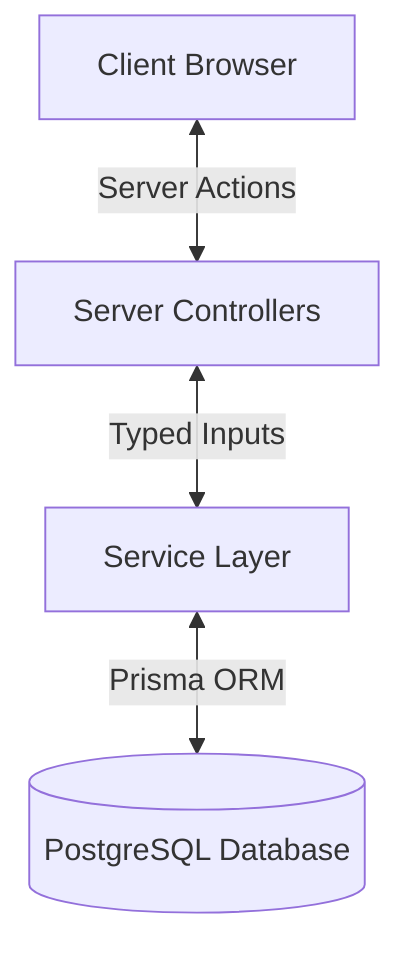
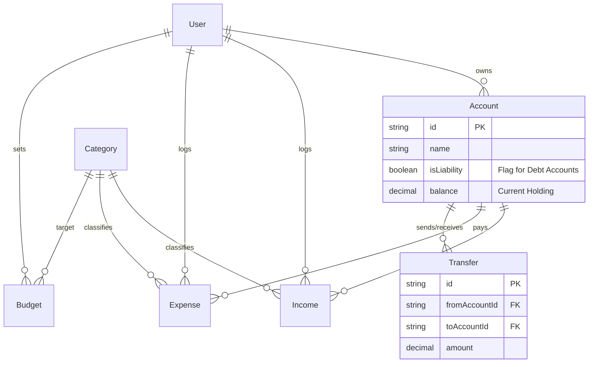

# System Architecture & Implementation Master Plan

## 1. Executive Summary

The **Personal Budget App** is a production-grade financial management system built on **Next.js 15**. It diverges from typical "CRUD" budgeting apps by implementing **Double-Entry Accounting Principles** (Atomic Transfers, Immutable Ledgers) wrapped in a modern, responsive UI.

**Core Philosophy**: "Data to Wisdom". The system is designed not just to track transactions (Data) but to analyze trends, savings rates, and debt paydown velocity (Wisdom).

---

## 2. Technical Architecture

The application follows a **Domain-Driven Design (DDD)** pattern, strictly separating concerns between the User Interface, Request Handling, and Business Logic.

### High-Level Stack



### Component Roles

1.  **UI Layer (`app/`, `components/`)**:

    -   **Responsibility**: Rendering, Client-side validation (Zod), Optimistic UI updates.
    -   **Tech**: React Server Components (RSC) + Client Components (Interactivity).
    -   **Styling**: Tailwind CSS 4 + shadcn/ui.

2.  **Controller Layer (`server/modules/*/controller.ts`)**:

    -   **Responsibility**: The "Gatekeeper". Handles Authentication check, Input Parsing, and Response Formatting.
    -   **Rule**: NO business logic allowed here.

3.  **Service Layer (`server/modules/*/service.ts`)**:
    -   **Responsibility**: The "Brain". Execute business rules, complex calculations (Net Worth, Budget Variance), and Database interactions.
    -   **Rule**: Must be pure TypeScript classes/objects, independent of HTTP context.

---

## 3. Database Schema (ERD)

The database is normalized to ensuring data integrity.



---

## 4. Core Algorithms & Logic

### A. Net Worth Calculation

_Calculated dynamically in `dashboard.service.ts`._

-   **Formula**: $\sum(Assets) - \sum(Liabilities)$
-   **Logic**: Iterates all accounts. If `isLiability` is true, the balance is treated as a debt.

### B. Atomic Transfers

_Implemented in `transfer.service.ts`._
To ensure money is never "lost" during a move, we use Prisma Transactions (`$transaction`):

1.  Create `Transfer` record.
2.  Decrement `FromAccount` balance.
3.  Increment `ToAccount` balance.
    _If any step fails, the entire database rolls back._

### C. Zero-Based Budgeting

_Implemented in `budget.service.ts`._

-   Budgets are **Categorical Limits** per month.
-   The system aggregates all `Expense` records for a specific `Category` and `Month`.
-   **Utilization %** = $(ActualExpenses / BudgetLimit) * 100$.

---

## 5. Directory Structure (Domain-Driven)

We avoid the "Sock Drawer" method (putting all controllers in one folder). Instead, we group by **Feature Domain**:

```bash
server/modules/
├── account/           # DOMAIN: Account Management
│   ├── account.controller.ts
│   ├── account.service.ts
│   └── account.types.ts
├── budget/            # DOMAIN: Budgeting Logic
├── report/            # DOMAIN: Analytics & Aggregation
└── ...
```

---

## 6. Security & Integrity

1.  **Authentication**: Handled via **NextAuth.js (v5)**. All Server Actions verify `session.user.id` before execution.
2.  **Type Safety**: End-to-end TypeScript. Database types are generated by Prisma, and API inputs are validated at runtime using **Zod**.
3.  **Data Isolation**: All database queries include `where: { userId }` to strictly sandbox user data.

---

## 7. Build & Deployment

-   **Containerization**: Dockerfile configured for `node:20-alpine`.
-   **Production Build**: Uses `output: 'standalone'` in Next.js to create a minimal 120MB image (vs 1GB+ standard).
-   **CI/CD**: Ready for GitHub Actions (Lint -> Build -> Push).
